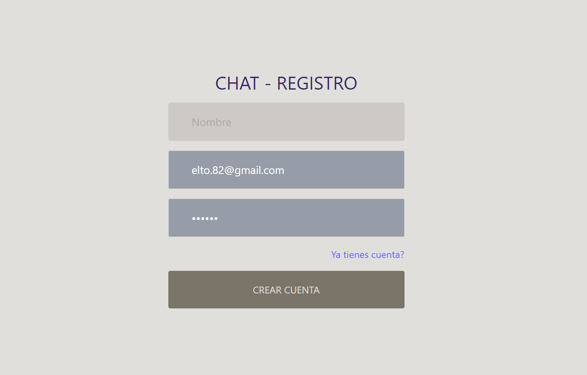

# ChatApp - Aplicación de Chat en Tiempo Real


## Descripción

ChatApp es una aplicación de chat en tiempo real construida con React que permite a los usuarios comunicarse en salas de chat en tiempo real. La aplicación cuenta con funciones de autenticación de usuarios y salas de chat interactivas.

## 


## Características

- **Registro y Autenticación de Usuarios:** Los usuarios pueden registrarse en la aplicación y autenticarse con sus credenciales.



- **Interfaz de Chat Interactiva:** La interfaz de chat permite a los usuarios ver los mensajes en tiempo real y enviar mensajes al chat.
  

- **Selección de Salas de Chat:** Los usuarios pueden unirse a salas de chat existentes o crear nuevas salas de chat.

- **Mensajería en Tiempo Real:** La aplicación utiliza WebSocket para proporcionar una experiencia de chat en tiempo real.

## Tecnologías Utilizadas

- **React:** La aplicación está construida con el framework de React para crear una interfaz de usuario interactiva y eficiente.

- **React Router:** Se utiliza para la gestión de rutas y navegación dentro de la aplicación.

- **Socket.IO:** Se implementa para habilitar la comunicación en tiempo real entre usuarios y salas de chat.

- **Moment.js:** Utilizado para formatear fechas y horas en el chat.

## Instalación

Sigue estos pasos para configurar la aplicación en tu máquina local:

1. Clona este repositorio a tu máquina local:

   ```
   git clone https://github.com/elto82/chat-app-react
Entra en el directorio del proyecto:

```
cd ChatApp
Instala las dependencias:

npm install
Inicia la aplicación:

npm start
Abre tu navegador y accede a http://localhost:3000 para ver la aplicación.

Uso
Registro y Autenticación: Inicia sesión o regístrate para acceder a la aplicación.

Elige una el Chat: Explora los chats disponibles o crea uno.

Chat en Tiempo Real: Entra en una sala de chat y comienza a enviar y recibir mensajes en tiempo real.

Disfruta del Chat: ¡Disfruta de tu experiencia de chat con otros usuarios!

Contribución
Si deseas contribuir a este proyecto, te animamos a crear un "fork" y enviar "pull requests" con tus mejoras. cualquier aporte para hacer de esta aplicación una herramienta aún mejor.

Licencia
Este proyecto se encuentra bajo la Licencia MIT. Consulta el archivo LICENSE para conocer los detalles de la licencia.